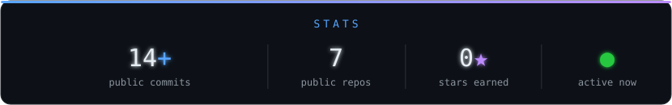

 

 

<table>
<tr><td valign="top" width="50%">

### `⌘ build`

</td><td valign="top" width="50%">

### `⚙ run`

</td></tr>
</table>

 

<a href="https://www.github.com/LucioDev404" target="_blank" rel="noreferrer"><picture><source media="(prefers-color-scheme: dark)" srcset="https://raw.githubusercontent.com/danielcranney/readme-generator/main/public/icons/socials/github-dark.svg" /><source media="(prefers-color-scheme: light)" srcset="https://raw.githubusercontent.com/danielcranney/readme-generator/main/public/icons/socials/github.svg" /></picture></a>
&nbsp;&nbsp;&nbsp;
<a href="https://www.linkedin.com/in/lucio-tavanti-472938258/" target="_blank" rel="noreferrer"><picture><source media="(prefers-color-scheme: dark)" srcset="https://raw.githubusercontent.com/danielcranney/readme-generator/main/public/icons/socials/linkedin-dark.svg" /><source media="(prefers-color-scheme: light)" srcset="https://raw.githubusercontent.com/danielcranney/readme-generator/main/public/icons/socials/linkedin.svg" /></picture></a>
&nbsp;&nbsp;&nbsp;
<a href="https://www.instagram.com/lucio.tavantii" target="_blank" rel="noreferrer"><picture><source media="(prefers-color-scheme: dark)" srcset="https://raw.githubusercontent.com/danielcranney/readme-generator/main/public/icons/socials/instagram-dark.svg" /><source media="(prefers-color-scheme: light)" srcset="https://raw.githubusercontent.com/danielcranney/readme-generator/main/public/icons/socials/instagram.svg" /></picture></a>

  

 

